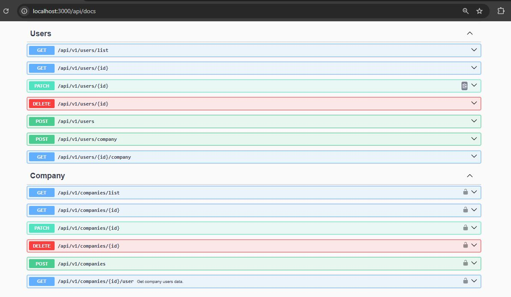

# Nestjs Mysql User Crud App


<hr>

## Introduction

This is a simple user and users related companies(m2m) crud api, Created using NestJs, Express, Mysql and TypeOrm. And this api is included with these api development technics such as Error handling, Request validation, Error logging and Api documentation.

## Features

Available features of the software,

- User and company (M2M) crud operations.
- Http request validation with joi.
- Included jwt authentication with passport.
- Well organized swagger api documentation.
- Error logging using winston.
- Jest unit test cases.

## Getting Started

- Install the node modelues using npm install command.

```bash
$ npm install
```

## Compile and run the project

```bash
# development
$ npm run start

# watch mode
$ npm run start:dev

# production mode
$ npm run start:prod
```

## Run tests

```bash
# unit tests
$ npm run test

# e2e tests
$ npm run test:e2e

# test coverage
$ npm run test:cov
```

### Prerequisites

All the dependencies are mentioned in the package.json file.
